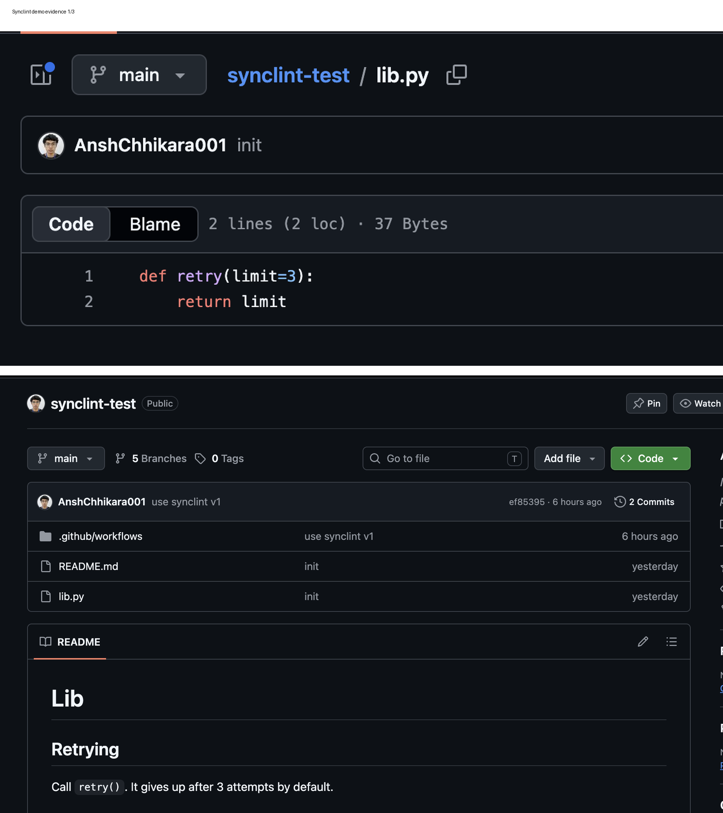
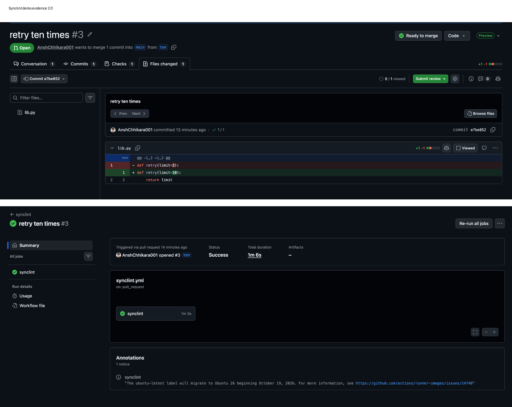

# synclint

A GitHub Action that finds the documentation a pull request made inaccurate,
repairs what it safely can, and flags the rest for a human.

Documentation goes wrong silently. A parameter is renamed, a default changes, a
capability is removed, and a paragraph somewhere in the repository is now a lie.
Nothing fails and no test goes red. synclint runs on the pull request, while the
author still has the context that makes fixing it a two-minute job.

It is on the [GitHub Marketplace](https://github.com/marketplace/actions/synclint).
On a [test pull request](https://github.com/AnshChhikara001/synclint-test/pull/3)
that changed a default from 3 to 10, the released `@v1` left one comment and
opened a [pull request of repairs](https://github.com/AnshChhikara001/synclint-test/pull/4)
that changed `3 attempts` to `10 attempts` and nothing else: 66 seconds
including the image build, four model calls, $0.0020.

## How it works

Three operations with no hidden coupling. `build_index` records a repository's
chunks of code, its sections of prose, and the links between them. `analyse`
takes that index and two git revisions and decides what drifted. `publish`
writes the result to GitHub. Neither of the first two talks to GitHub, so every
judgement the tool makes is reachable offline and testable without it.

1. **Index.** Chunks come from the standard library's `ast` — signature,
   docstring and decorators, never bodies (ADR-0001). Sections are markdown
   split at every heading. Links are proposed by name matching and,
   optionally, by embedding similarity: one numpy matrix product, no vector
   database (ADR-0002). Each link records which mechanism proposed it.
2. **Compare.** The files a pull request modified since it forked from the
   base branch — the merge base, not the base branch's tip — reduced to the
   chunks whose syntax trees changed, reduced again to the sections linked to
   them. Comments, formatting and docstring edits do not survive a parse, so
   they cannot produce a finding.
3. **Verify.** Each of those sections is a *suspect*, put to the model with
   the chunk as it read before the change and after: is it still accurate?
   Sections found accurate are reported too, so silence about a section means it was
   never in question. A chunk that is gone is looked for first — in the file
   git's rename detection pairs its old file with, then as the one chunk of its
   qualified name that appeared anywhere else. What is left is a
   *disappearance*: every section naming it is flagged without a model call,
   since nothing the model said could make the section right.
4. **Repair and validate.** Each finding is rewritten into its section. The
   model answers with quoted spans and their replacements, and synclint applies
   them itself. A second model pass validates the rewrite. A quote the section
   does not contain exactly once, or a rewrite validation refuses, becomes a
   flag with its reason.
5. **Gate** (ADR-0003). A repair is proposed only if its change has one of two
   shapes read off the syntax trees: one parameter renamed everywhere it is
   used, or one default changed with nothing else touched. Inside the gate the
   model's confidence must reach `--confidence-threshold`, 0.9, set before any
   answer was recorded. Everything else is flagged, with the rewrite that was
   tried as a reviewer's starting point.
6. **Publish.** One summary comment, found by a hidden marker and edited in
   place on every push: sections checked, accurate, repaired and flagged, each
   linked to its lines. Proposed repairs go out as one commit on
   `synclint/repairs-N`, in a pull request against the branch under review.
   Two repairs to one section, or a section that no longer reads as it did
   when analysed, stay in the comment; so do all repairs, as diffs, when
   GitHub answers the token 403 on pushing a branch. `publish` decides nothing
   itself; the routing is a function of the report. Stdlib `urllib`, no GitHub
   SDK.

Every model answer is recorded on disk, keyed by prompt; a ledger counts tokens
and dollars; and a spend ceiling is checked before each call rather than after. One
provider serves both the reasoning passes and the embeddings (ADR-0005).

The index is committed at `.synclint/index.json` with the commit it was built at,
and `.github/workflows/index.yml` rebuilds it when Python or documentation lands
on main. A run trusts it only if no file it reads differs between that commit
and the base — content, not commit identity, since the commit that commits an
index is never the one it was built at. Otherwise the run builds its own at the
base from `git archive`. An out-of-date index makes a run slower, not wrong, and
the comment says which index was used and why.

## Measured results

Every figure here replays from committed answers, costs nothing to reproduce,
and is the same on every run. Tests pin the corpus and link-recall figures, so
those cannot drift from the harness that produced them; the humanize replay
compares itself with what the paying run printed. The model is gpt-5.4-mini at low reasoning
effort, and nothing was tuned against these numbers.

### On the fixture corpus

`corpus/` is a small library, eleven modules and nine markdown pages, with
eighteen planted drift cases and fourteen decoys — changes that break nothing
and must produce nothing — each with ground truth. Recording its 31
verification answers cost $0.0217.

    python -m synclint score corpus

| Drift kind | Planted | Found | Recall |
| --- | --- | --- | --- |
| renamed-parameter | 5 | 1 | 20% |
| changed-default | 5 | 3 | 60% |
| removed-capability | 5 | 5 | 100% |
| contradicted-claim | 2 | 1 | 50% |
| deleted-chunk | 1 | 1 | 100% |
| All | 18 | 11 | 61% |

**Precision 100%** (11 true positives, 0 false positives). **Recall 61%** (11
true positives, 7 false negatives). **False positive rate 0%** (0 of 14 decoys
reported drift).

| Decoy kind | Decoys | Reach the model | False positives |
| --- | --- | --- | --- |
| internal-refactor | 4 | 4 | 0 |
| added-parameter | 3 | 3 | 0 |
| comment-edit | 2 | 0 | 0 |
| test-only | 2 | 0 | 0 |
| formatting | 2 | 0 | 0 |
| moved-chunk | 1 | 0 | 0 |
| All | 14 | 7 | 0 |

Half of that 0% is the design, not the model: seven decoys raise no suspect and
cannot produce a finding whatever it says. The other seven reach the model and
it cleared all seven, which is a small denominator.

The model errs toward clearing: nothing it reported was wrong, and five of the
seven misses are suspects it saw and cleared:

- **Four of the five renamed parameters.** `find(query)` documented,
  `find(text)` shipped, and the model judged that a reader following the page is
  not misled. Anyone calling it by keyword gets a `TypeError`. This is the
  first thing to fix, and the harness will say whether it was fixed for two
  cents.
- **One changed default**, where `read_csv` stopped skipping invalid rows and
  started raising on them.

The other two never reach the model: a default that lives in `__init__` while
the prose names the class, and a wholly new method.

The first scoring read 50%, and the difference is not an improvement to the
tool. Five cases asserted that code gaining an undocumented parameter is drift;
the verification prompt denies it and the glossary settles against it — drift
is a section that is *inaccurate*, and a page that never mentioned the new
parameter is merely silent. Three became decoys; the two whose pages make a
claim the change falsifies stayed. No answer was re-asked: the same recorded
run was scored against ground truth that no longer argued with itself.
`corpus/README.md` has the argument in full.

### What embedding links buy

The same harness measures link recall — how many planted section-chunk pairs
the index links at all — by name alone and with text-embedding-3-small added.
The vectors are committed, so this replays for free too.

| Links | Pairs linked | Planted pairs linked | Link recall | Suspects on cases | Suspects on decoys |
| --- | --- | --- | --- | --- | --- |
| name | 48 | 16 of 18 | 89% | 20 | 11 |
| name + embedding ≥ 0.55 | 84 | 17 of 18 | 94% | 36 | 15 |

**The delta is one case**, and it costs 36 more links and 20 more questions to
the model per corpus run, four of them on decoys. The pair gained is
`shelf-capacity-default`: the prose describes a constructor default and names
the class, and the embedding puts it next to `Shelf.__init__` at 0.597, where
name matching cannot. The other miss, a new method, has no chunk at the base for
anything to link to.

| Threshold | Pairs linked | Link recall | Suspects on cases | Suspects on decoys |
| --- | --- | --- | --- | --- |
| 0.65 | 55 | 89% | 22 | 11 |
| 0.60 | 61 | 89% | 24 | 12 |
| 0.55 | 84 | 94% | 36 | 15 |
| 0.50 | 124 | 94% | 48 | 23 |
| 0.45 | 164 | 94% | 60 | 26 |

The trade is lumpy, not smooth: at 0.60 and above the embeddings add links but
not that case, and below 0.55 only suspects. 0.55 is the 95th percentile of
similarity over every section-chunk pair in the corpus, chosen from that
distribution rather than from the cases. Embedding the corpus cost 2,400
tokens, $0.000048. On pages that name what they document, name matching was
already doing nearly all the work. Findings are still scored over name links:
the extra suspects have no recorded answers, so whether the model then finds
the shelf case is unmeasured.

### What repairs look like

The manifest carries ground truth for every repair — text a correct one must
say, and text it must no longer say — so validation, itself a model's
judgement, is scored against something that is not. Recording the 17 repair and
validation answers cost $0.0139, and the three confidence answers $0.0022.

| Repaired case | Shape | Outcome | Confidence | Ground truth | Text kept |
| --- | --- | --- | --- | --- | --- |
| write-json-path-renamed | renamed-parameter | proposed | 97% | correct | 98% |
| renew-days-default | changed-default | not applied | — | not applied | — |
| write-csv-columns-default | changed-default | proposed | 98% | correct | 94% |
| matches-case-sensitive-default | changed-default | proposed | 98% | correct | 81% |
| remove-returns-nothing | — | not applied | — | not applied | — |
| load-drops-create-missing | — | outside the gate | — | correct | 54% |
| parse-query-drops-or | — | not applied | — | not applied | — |
| overdue-drops-grace | — | outside the gate | — | correct | 49% |
| titles-drops-sort | — | outside the gate | — | correct | 55% |
| is-valid-gains-isbn10 | — | outside the gate | — | incorrect | 83% |

**Validation passed all seven it saw, one of them wrong. The gate stopped that
one.** The `is_valid` repair admits ten-digit ISBNs but keeps the advice to
convert them first, which the change made pointless. Its change rewrites a
function body, not a shape the gate admits, so it is flagged. The price is three
correct repairs flagged with it, because a removed capability is never one
narrow shape. **Three proposed, three correct**, where validation alone would
have proposed seven with one wrong.

| Shape | Repairs | Correct | Proposed at ≥ 90% | Proposed and correct |
| --- | --- | --- | --- | --- |
| renamed-parameter | 1 | 1 (100%) | 1 | 1 |
| changed-default | 3 | 2 (67%) | 2 | 2 |
| outside the gate | 6 | 3 (50%) | 0 | 0 |

The rules did all of the work and the threshold none: the model gave the three
repairs inside the gate 97–98%, so any threshold up to 0.97 proposes the same
three. The gate's shapes agree with the manifest's hand-written kinds on all
sixteen cases that change a chunk, though the rules were written from the ADR,
not from the corpus.

Three repairs never reached validation because their quotes did not match the
section — two quoted the whole section plus a newline it does not end with, one
garbled the quote. Text kept is low partly because nine of the ten repairs
quoted the whole section and rewrote it. Telling the repair pass to quote only
the wrong words, and refusing a whole-section quote in code, was tried: seven
of ten still quoted everything, the guard refused all seven, and one repair in
ten came out proposed and correct. That cost $0.0114 and is reverted; commit
`68c98d0` keeps its answers so the numbers can be recomputed.

### On a real repository

The corpus was written by the same hand as the tool, so the same test was run
on code nobody here wrote: [humanize](https://github.com/python-humanize/humanize)
at `392aef7`, its README split into eighteen sections with sixteen name links.
Seven changes break a README example and four are decoys that break nothing.
Each is a patch in `validation/humanize/changes/`, analysed through the command
line the Action calls; `validation/humanize/run.sh` replays it for nothing.

| Change | Should | Did | Repair |
| --- | --- | --- | --- |
| `naturalsize(binary=)` renamed `iec=` | find | found | proposed, 96%, correct |
| `scientific` precision default 2 → 3 | find | found | proposed, 99%, correct |
| `precisedelta` format default `%0.2f` → `%0.1f` | find | found | proposed, 98%, correct |
| `fractional(1.5)` gives `3/2`, not `1 1/2` | find | found | flagged (body), draft correct |
| `naturaldate` gives ISO dates past five months | find | found | flagged (body), draft correct |
| `apnumber` deleted | find | found, a disappearance | flagged (gone) |
| `naturalday` renamed `natural_day` | find | found, a disappearance | flagged (gone) |
| `intcomma` body rewritten, same output | nothing | nothing, cleared | — |
| `intword(format=)` renamed, README never passes it | nothing | nothing, cleared | — |
| `naturalsize` gains `separator=" "` | nothing | nothing, cleared | — |
| a comment in `scientific` reworded | nothing | nothing, never asked | — |

**Seven of seven found, no decoy reported, three repairs proposed and all three
right**, checked by hand against the patched code. Twenty-two model calls cost
$0.0293.

The first run found five, and both misses were the same gap. A deleted function
had no chunk after the change, so nothing was compared. The rename was worse:
`naturaldate`, which calls `naturalday`, changed two lines, so the section that
calls `naturalday` three times was verified against `naturaldate` and rightly
judged accurate *about `naturaldate`* — one section verified, none drifted,
true and misleading. Following deleted chunks turned both into disappearances,
found on replay without a model call, and nothing else in the eleven moved.

Two things went better than on the corpus. Every repair quoted only the lines
it changed; these pages are doctest examples, one claim per line, which likely
explains it more than anything synclint did. And name matching proposed no
wrong link, because humanize's prose names functions in full, as
`humanize.naturalsize(...)`. This ran from the command line, not as an
installed Action; the Action's path from event to `analyse` is exercised by the
live run above.

The suite is 227 tests under mypy strict, with no API spend: every test replays
a recorded answer or injects a fake.

## Using it

    name: synclint
    on: pull_request
    permissions:
      contents: write        # the branch of repairs
      pull-requests: write   # the comment, and the pull request of repairs
    jobs:
      synclint:
        runs-on: ubuntu-latest
        steps:
          - uses: actions/checkout@v5
            with:
              ref: ${{ github.event.pull_request.head.sha }}  # not the merge commit
              fetch-depth: 0   # both revisions; a shallow clone is refused
          - uses: AnshChhikara001/synclint@v1
            with:
              api-key: ${{ secrets.OPENAI_API_KEY }}

The other inputs — `documentation-glob`, `model`, `confidence-threshold`,
`ceiling` — default to the command line's defaults; `action.yml` describes each.
The key reaches the container as an environment variable, never an argument,
because the runner prints a container's arguments. The head is checked out
rather than GitHub's merge commit so the working tree is the code under review.

To keep a committed index fresh, copy `.github/workflows/index.yml`, installing
synclint with `pip install git+https://github.com/AnshChhikara001/synclint@v1`
in place of `pip install .`. Without it every run builds its own index, which
costs seconds and no money.

## Limitations

- **Python only.** Chunks come from the standard library's `ast` (ADR-0001); a
  change in any other language raises nothing.
- **Docstrings are not checked** (ADR-0004). Documentation means markdown under
  the configured globs. A docstring is part of the chunk it documents, and
  drift between a thing and a part of itself is a different problem. This is a
  scope boundary, not a gap to close.
- **Pull requests from forks and from Dependabot go unreviewed.** GitHub gives
  their `pull_request` runs no secrets, so there is no key; the Action warns and
  exits cleanly rather than failing their checks. `pull_request_target` would
  reach them, with repairs degraded to diffs in the comment, and is not the
  documented trigger because the workflow around the
  Action would then be one careless step from running a stranger's code with
  the repository's key (ADR-0006).
- **Two in five planted cases go unfound**, and a renamed parameter, the easiest
  drift there is, is found one time in five. Whether reasoning effort or the
  prompt is to blame is untested.
- **Name matching is permissive.** It costs nothing on the corpus and humanize,
  whose pages name what they document, but pointed at this repository every
  link it proposes is wrong — `id`, `write`, `spend` and `git` all match as
  ordinary English. The 100% is precision over findings on well-behaved pages,
  not a claim about links in general.
- **Embedding links are costly for what they add**: one planted pair for 20
  more suspects per run, on one small corpus with one embedding model. The
  threshold was set on this corpus and may not transfer.
- **A default declared in a constructor is unreachable by name.** Embedding
  links reach the corpus's one example; whether they reach it in general is
  unmeasured. A chunk the change adds is invisible too: only code that existed before the change is
  compared, so a page claiming to list everything is not caught falling behind.
- **A disappearance is only as good as the name link behind it.** It is never
  put to a model, so a deleted method called `write` would flag every section
  using the word. A move is followed only when it is unambiguous and keeps the
  qualified name: a function renamed, or moved into a class, is reported gone.
- **Validation grades the same model's work.** It refused none of the seven
  repairs it saw, one of them wrong. The gate caught that one, but cannot catch
  a wrong repair of an eligible shape, and the ground truth that judges repairs
  is hand-written for seventeen sections.
- **The calibration table is four repairs deep inside the gate**, and the
  model's confidence did not vary enough to test the threshold at all.
- **The gate is narrow on purpose.** Every removed capability is flagged even
  when the repair is right, and a flagged finding still pays for a repair and
  its validation so the reviewer has a draft.
- **A repair rewrites the whole section.** At low reasoning effort the model
  will not quote small even when told to, so byte-identity outside the edits
  holds only in name; text kept measures the damage and nothing bounds it.
  Quotes must also match exactly, and three of ten repairs were lost to that.
- **Sections are read at the base.** A pull request that changes a function and
  fixes its documentation together has the section checked as it read before
  the fix, and can be told to fix what it already fixed.
- **The committed index goes out of date more often than it needs to.** Any
  Python or documentation file that differs since it was built counts, whether
  or not the difference touches a chunk or a section, so the fallback runs more
  often than it has to, and the fallback links by name only. The
  rebuild workflow assumes the default globs, pushes to main (a protection rule
  that refuses its token leaves the index behind), and loses a race with a push
  that lands while it runs. An index does not record which synclint built it.
  The fallback reads the base through `git archive`, so `export-ignore` files
  and submodules are missing from it.
- **The repair branch is rebuilt on every push**, so a human's amendment to
  `synclint/repairs-N` is overwritten, and a repair pull request stays open
  after a push that leaves nothing to repair. It also triggers the workflow
  itself, which GitHub holds for approval.
- **The image is built on every run**, not pulled from a registry: 95MB
  compressed, about 12 seconds cold on a laptop.

`CONTEXT.md` is the glossary; `docs/adr/` holds the decisions and what was
rejected; `corpus/README.md` describes every case and decoy.
