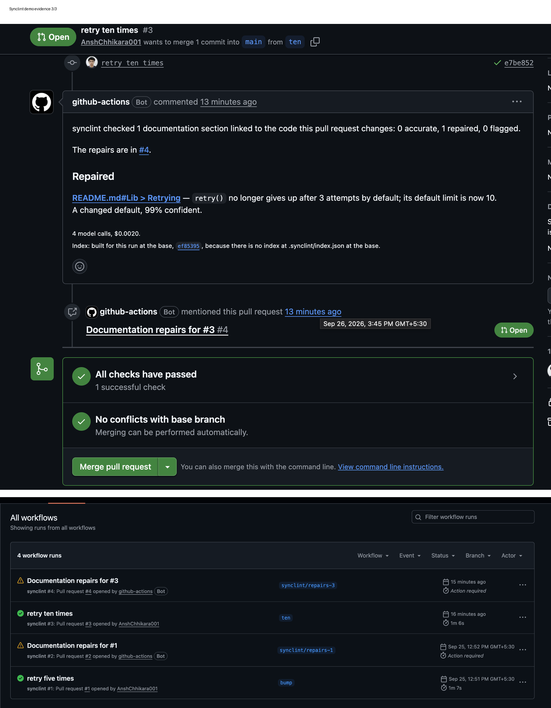

# synclint

A GitHub Action that finds the documentation a pull request made wrong,
repairs what it safely can, and flags the rest for a human.

A parameter is renamed, a default changes, a capability is removed, and a
paragraph in the README is now a lie. Nothing fails and no test goes red.
synclint catches it on the pull request, while the author still has the context
to fix it in two minutes.

[On the GitHub Marketplace](https://github.com/marketplace/actions/synclint) ·
Python · gpt-5.4-mini · 227 tests, mypy strict

## A live run

A [pull request](https://github.com/AnshChhikara001/synclint-test/pull/3)
changes `retry(limit=3)` to `limit=10`. synclint comments, then opens a
[pull request of repairs](https://github.com/AnshChhikara001/synclint-test/pull/4)
that changes `3 attempts` to `10 attempts` in the README, and nothing else.
66 seconds, four model calls, $0.0020.

More screenshots: [before the change](docs/demo/before.png),
[the pull request and the run](docs/demo/pull-request-and-run.png).

## Results

Measured on a fixture corpus with planted drift and *decoys* — changes that
break nothing and must produce nothing — and on eleven changes planted in a
real library nobody here wrote,
[humanize](https://github.com/python-humanize/humanize). Every answer is
committed, so every figure replays for free: `python -m synclint score corpus`.

| | Fixture corpus | humanize |
| --- | --- | --- |
| Drift found (recall) | 11 of 18 (61%) | 7 of 7 |
| Precision | 100% | 100% |
| False positive rate on decoys | 0 of 14 | 0 of 4 |
| Repairs proposed, and correct | 3, all correct | 3, all correct |
| Cost to record the answers | $0.038 | $0.029 |

What the numbers say:

- **The model errs toward clearing.** Nothing it reported was wrong, and 5 of
  the 7 corpus misses are sections it saw and cleared. Worst case: a renamed
  parameter is found 1 time in 5.
- **Rules beat confidence.** Validation, a second model pass, approved 7
  repairs, one of them wrong. The rules-based gate, which only auto-repairs a
  renamed parameter or a changed default, stopped it. The model's confidence
  threshold did nothing: it said 96–99% every time.
- **Embeddings barely helped.** They raised link recall from 89% to 94% — one
  case — for 20 more model calls per corpus run. Name matching already did
  nearly all the work.
- **The corpus was wrong once, and it says so.** The first score was 50%.
  Five cases called "code gained an undocumented parameter" drift, which it
  isn't; three became decoys. Same recorded answers, corrected ground truth.

Full tables, the experiment that failed, and every miss explained:
[docs/measurements.md](docs/measurements.md).

## How it works

1. **Index** — code chunks from Python's `ast` (signatures, never bodies),
   markdown sections split at headings, and links between them by name
   matching, optionally by embedding similarity (numpy, no vector database).
2. **Compare** — only chunks whose syntax tree changed count, so comments,
   formatting and docstring edits can't raise anything.
3. **Verify** — each linked section goes to the model with the code before and
   after: is it still accurate? Deleted code is followed through renames and
   moves first; a section naming code that is truly gone is flagged without a
   model call.
4. **Repair** — the model returns quoted edits, synclint applies them, and a
   second model pass validates the result.
5. **Gate** — a repair is proposed only if the change is a renamed parameter
   or a changed default, read off the syntax trees, and the model is at least
   90% confident. Everything else is flagged with a draft rewrite.
6. **Publish** — one comment on the pull request, updated each push, plus a
   pull request of repairs against the branch under review.

Every answer is recorded, and a spend ceiling is checked before each call.
The reasoning behind each choice is in [`docs/adr/`](docs/adr/); the
vocabulary is in [`CONTEXT.md`](CONTEXT.md).

## Using it

    name: synclint
    on: pull_request
    permissions:
      contents: write        # the branch of repairs
      pull-requests: write   # the comment, and the pull request of repairs
    jobs:
      synclint:
        runs-on: ubuntu-latest
        steps:
          - uses: actions/checkout@v5
            with:
              ref: ${{ github.event.pull_request.head.sha }}
              fetch-depth: 0
          - uses: AnshChhikara001/synclint@v1
            with:
              api-key: ${{ secrets.OPENAI_API_KEY }}

Other inputs (`documentation-glob`, `model`, `confidence-threshold`, `ceiling`)
are described in [`action.yml`](action.yml).

## Limitations

- **Python only**, and **docstrings are not checked** — documentation means
  markdown. Both are deliberate scope (ADR-0001, ADR-0004).
- **Fork and Dependabot pull requests go unreviewed.** GitHub gives them no
  secrets, so there is no API key; `pull_request_target` would, at the risk of
  running a stranger's code with your key (ADR-0006).
- **Recall is 61%** on the corpus, untuned, on the cheapest model at low
  reasoning effort.
- **Name matching is noisy on ordinary words.** On this repository's own
  README, `id`, `write` and `git` all match as English.
- **New code is invisible.** Only code that existed before the change is
  compared, so a page claiming to list everything isn't caught falling behind.
- **Validation grades the same model's work**, and the gate can't catch a
  wrong repair of an eligible shape.
- **Small samples.** 18 cases, 14 decoys, 11 real-repo changes; four repairs
  inside the gate.

All of them, including the index and Action edge cases:
[docs/limitations.md](docs/limitations.md).
